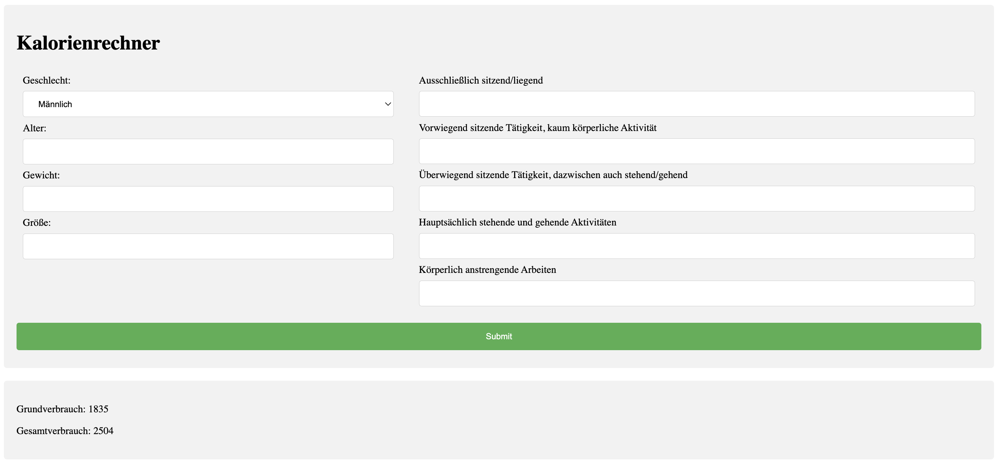

# Aufgabe 4

#### Schuljahr: 24/25
#### Lehrgang: 2
#### Übungstag: 20.11.2024
#### Name: Jakob Lipp
#### Klasse: 3a APC
#### Gruppe: B

## Installation
Öffne CMD oder Terminal

```
git clone https://github.com/LBSEibiswaldITL12/A4.git

# oder über ssh

git clone git@github.com:LBSEibiswaldITL12/A4.git


cd A4
docker compose up -d

# Open localhost:80 in web
```

## Umsetzung



In dieser Aufgabe haben wir ein etwas größeres Form erstellt. Die eingabe auf der Linken Seite sind required und die auf der Rechten Seite sind nicht required dort werden dann die felder wenn nichts angegeben wird mit 0 angegeben im php teil.

Das PHP File [index.php](/index.php)